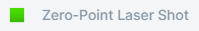

# Understanding the Wiki

## Emoji Info:

The :warning: emoji represents a tech that is not reproducible or lacks guidance.

The :green\_square: emoji represents a tech that tends to benefit the titan.

The :red\_square: emoji represents a tech that will be abused to counter the titan.

